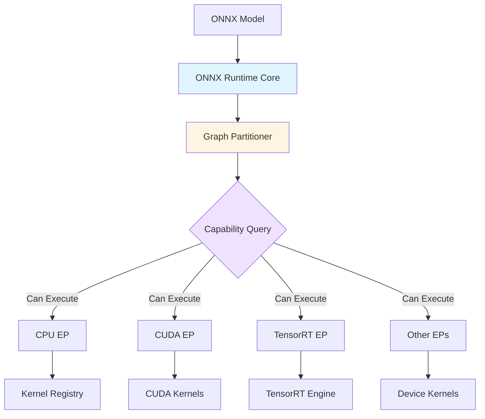
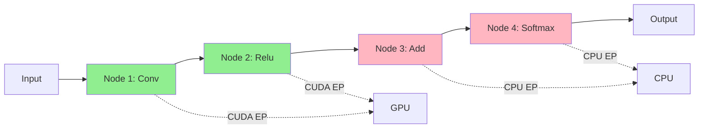

Execution Providers (EPs) are the interfaces that enable ONNX Runtime to execute models on different hardware platforms. They provide hardware-specific optimizations and acceleration capabilities.

## What are Execution Providers?

Execution Providers abstract the hardware-specific implementation details, allowing ONNX Runtime to:

- **Accelerate inference** using specialized hardware (GPUs, NPUs, etc.)
- **Optimize operators** for specific hardware architectures
- **Manage memory** efficiently on target devices
- **Handle data transfer** between different memory spaces

<Info>
  Think of Execution Providers as "backends" or "device drivers" for ONNX Runtime, similar to how TensorFlow has device placements or PyTorch has device types.
</Info>

## Architecture Overview



### How EPs Work

<Steps>
  <Step title="Registration">
    Execution providers are registered with the session during initialization
  </Step>
  
  <Step title="Capability Query">
    Each EP reports which nodes/subgraphs it can execute via `GetCapability()`
  </Step>
  
  <Step title="Graph Partitioning">
    ONNX Runtime partitions the graph across available EPs based on their capabilities
  </Step>
  
  <Step title="Kernel Execution">
    Each node is executed by its assigned EP using hardware-specific kernels
  </Step>
</Steps>

## Available Execution Providers

### CPUExecutionProvider

The default execution provider, always available:

<CardGroup cols={2}>
  <Card title="Platforms" icon="computer">
    - Windows, Linux, macOS
    - x86_64, ARM64, ARM32
    - WebAssembly
  </Card>
  <Card title="Features" icon="list-check">
    - Comprehensive operator coverage
    - SIMD optimizations (SSE, AVX, NEON)
    - Multi-threading support
    - Reference implementation
  </Card>
</CardGroup>

```python
import onnxruntime as ort

# CPU is used by default
session = ort.InferenceSession("model.onnx")

# Explicit configuration
sess_options = ort.SessionOptions()
sess_options.intra_op_num_threads = 4
session = ort.InferenceSession(
    "model.onnx",
    sess_options,
    providers=['CPUExecutionProvider']
)
```

### CUDAExecutionProvider

NVIDIA GPU acceleration using CUDA:

<Tabs>
  <Tab title="Python">
    ```python
    import onnxruntime as ort
    
    # Use CUDA with default settings
    session = ort.InferenceSession(
        "model.onnx",
        providers=['CUDAExecutionProvider', 'CPUExecutionProvider']
    )
    
    # Configure CUDA options
    cuda_options = {
        'device_id': 0,
        'arena_extend_strategy': 'kNextPowerOfTwo',
        'gpu_mem_limit': 2 * 1024 * 1024 * 1024,  # 2GB
        'cudnn_conv_algo_search': 'EXHAUSTIVE',
        'do_copy_in_default_stream': True,
    }
    
    session = ort.InferenceSession(
        "model.onnx",
        providers=[('CUDAExecutionProvider', cuda_options),
                   'CPUExecutionProvider']
    )
    ```
  </Tab>
  
  <Tab title="C++">
    ```cpp
    #include <onnxruntime_cxx_api.h>
    
    Ort::Env env(ORT_LOGGING_LEVEL_WARNING, "test");
    Ort::SessionOptions session_options;
    
    // Append CUDA execution provider
    OrtCUDAProviderOptions cuda_options;
    cuda_options.device_id = 0;
    cuda_options.arena_extend_strategy = OrtArenaExtendStrategy::kNextPowerOfTwo;
    cuda_options.gpu_mem_limit = 2ULL * 1024 * 1024 * 1024;
    
    session_options.AppendExecutionProvider_CUDA(cuda_options);
    
    Ort::Session session(env, L"model.onnx", session_options);
    ```
  </Tab>
</Tabs>

<Accordion title="CUDA Provider Options">
  | Option | Description | Default |
  |--------|-------------|----------|
  | `device_id` | GPU device ID | 0 |
  | `gpu_mem_limit` | Maximum GPU memory usage (bytes) | SIZE_MAX |
  | `arena_extend_strategy` | Memory arena growth strategy | `kNextPowerOfTwo` |
  | `cudnn_conv_algo_search` | cuDNN convolution algorithm search | `EXHAUSTIVE` |
  | `do_copy_in_default_stream` | Use default CUDA stream for copies | True |
  | `cudnn_conv_use_max_workspace` | Use maximum workspace for cuDNN | True |
</Accordion>

### TensorRTExecutionProvider

Optimized inference using NVIDIA TensorRT:

```python
import onnxruntime as ort

trt_options = {
    'device_id': 0,
    'trt_max_workspace_size': 2 * 1024 * 1024 * 1024,  # 2GB
    'trt_fp16_enable': True,  # Enable FP16 precision
    'trt_int8_enable': False,
    'trt_engine_cache_enable': True,
    'trt_engine_cache_path': './trt_cache',
}

session = ort.InferenceSession(
    "model.onnx",
    providers=[('TensorrtExecutionProvider', trt_options),
               'CUDAExecutionProvider',
               'CPUExecutionProvider']
)
```

<Warning>
  TensorRT builds optimized engines at runtime. The first inference run will be slower as engines are built and cached.
</Warning>

### DirectMLExecutionProvider

Hardware acceleration on Windows using DirectML:

```python
import onnxruntime as ort

session = ort.InferenceSession(
    "model.onnx",
    providers=['DmlExecutionProvider', 'CPUExecutionProvider']
)
```

<CardGroup cols={2}>
  <Card title="Advantages" icon="check">
    - Works with any DirectX 12 GPU
    - AMD, Intel, NVIDIA support
    - Built into Windows
  </Card>
  <Card title="Use Cases" icon="lightbulb">
    - Windows client applications
    - Cross-vendor GPU support
    - Integrated graphics
  </Card>
</CardGroup>

### CoreMLExecutionProvider

Apple Silicon and iOS acceleration:

```python
import onnxruntime as ort

coreml_options = {
    'MLComputeUnits': 'ALL',  # CPU_AND_GPU, CPU_ONLY, or ALL
}

session = ort.InferenceSession(
    "model.onnx",
    providers=[('CoreMLExecutionProvider', coreml_options),
               'CPUExecutionProvider']
)
```

### Additional Execution Providers

<AccordionGroup>
  <Accordion title="OpenVINO (Intel)">
    Intel CPU, GPU, VPU, and FPGA acceleration:
    ```python
    openvino_options = {
        'device_type': 'CPU_FP32',  # CPU_FP32, GPU_FP32, GPU_FP16, etc.
        'num_of_threads': 8,
    }
    session = ort.InferenceSession(
        "model.onnx",
        providers=[('OpenVINOExecutionProvider', openvino_options)]
    )
    ```
  </Accordion>
  
  <Accordion title="NNAPI (Android)">
    Android Neural Networks API:
    ```python
    session = ort.InferenceSession(
        "model.onnx",
        providers=['NnapiExecutionProvider', 'CPUExecutionProvider']
    )
    ```
  </Accordion>
  
  <Accordion title="ACL (ARM)">
    ARM Compute Library for ARM CPUs:
    ```python
    session = ort.InferenceSession(
        "model.onnx",
        providers=['AclExecutionProvider', 'CPUExecutionProvider']
    )
    ```
  </Accordion>
  
  <Accordion title="ROCM (AMD)">
    AMD GPU acceleration:
    ```python
    rocm_options = {
        'device_id': 0,
        'gpu_mem_limit': 2 * 1024 * 1024 * 1024,
    }
    session = ort.InferenceSession(
        "model.onnx",
        providers=[('ROCMExecutionProvider', rocm_options)]
    )
    ```
  </Accordion>
</AccordionGroup>

## EP Selection and Fallback

### Provider Priority

Execution providers are tried in the order specified:

```python
# TensorRT tried first, then CUDA, then CPU
session = ort.InferenceSession(
    "model.onnx",
    providers=[
        'TensorrtExecutionProvider',
        'CUDAExecutionProvider',
        'CPUExecutionProvider'
    ]
)
```

<Info>
  If a provider cannot execute a node, it falls back to the next provider in the list. CPU is typically the last fallback.
</Info>

### Checking Active Providers

```python
import onnxruntime as ort

# Check available providers
print("Available providers:", ort.get_available_providers())

# Check session providers
session = ort.InferenceSession("model.onnx")
print("Session providers:", session.get_providers())
```

## Graph Partitioning

ONNX Runtime partitions the graph across execution providers:



### Capability Query

Each EP implements `GetCapability()` to report which nodes it can execute:

```cpp
// Simplified EP capability interface
class IExecutionProvider {
  virtual std::vector<std::unique_ptr<ComputeCapability>>
  GetCapability(
    const GraphViewer& graph_viewer,
    const IKernelLookup& kernel_lookup
  ) const;
};
```

<Tip>
  Use verbose logging to see how nodes are partitioned:
  ```python
  sess_options = ort.SessionOptions()
  sess_options.log_severity_level = 0  # Verbose
  session = ort.InferenceSession("model.onnx", sess_options)
  ```
</Tip>

## Data Transfer

Execution providers manage data transfer between memory spaces:

### Memory Locations

- **CPU memory**: Host memory accessible by CPU
- **GPU memory**: Device memory on GPU
- **Shared memory**: Accessible by both CPU and GPU

### IOBinding for Efficient Transfer

Use IOBinding to avoid unnecessary data copies:

<CodeGroup>
```python CUDA Example
import onnxruntime as ort
import numpy as np

session = ort.InferenceSession("model.onnx", providers=['CUDAExecutionProvider'])

# Create IOBinding
io_binding = session.io_binding()

# Bind input to GPU
input_data = np.random.randn(1, 3, 224, 224).astype(np.float32)
io_binding.bind_cpu_input('input', input_data)

# Bind output to GPU
io_binding.bind_output('output', 'cuda')

# Run on GPU
session.run_with_iobinding(io_binding)

# Get output (still on GPU)
output = io_binding.copy_outputs_to_cpu()[0]
```

```python Pre-allocated Memory
import onnxruntime as ort
import numpy as np

session = ort.InferenceSession("model.onnx")
io_binding = session.io_binding()

# Pre-allocate output buffer
output_shape = session.get_outputs()[0].shape
output_buffer = np.empty(output_shape, dtype=np.float32)

# Bind to pre-allocated memory
io_binding.bind_cpu_input('input', input_data)
io_binding.bind_output('output', 'cpu', output_buffer)

session.run_with_iobinding(io_binding)
# Output is now in output_buffer, no copy needed
```
</CodeGroup>

## Custom Execution Providers

You can implement custom execution providers for specialized hardware:

```cpp
// Simplified custom EP structure
class CustomExecutionProvider : public IExecutionProvider {
public:
  CustomExecutionProvider(const std::string& type, OrtDevice device)
      : IExecutionProvider(type, device) {}
  
  // Report which nodes this EP can execute
  std::vector<std::unique_ptr<ComputeCapability>>
  GetCapability(const GraphViewer& graph,
                const IKernelLookup& kernel_lookup) const override {
    // Inspect graph and return capability
  }
  
  // Get kernel registry
  std::shared_ptr<KernelRegistry> GetKernelRegistry() const override {
    return kernel_registry_;
  }
  
  // Data transfer implementation
  std::unique_ptr<IDataTransfer> GetDataTransfer() const override {
    return std::make_unique<CustomDataTransfer>();
  }
};
```

<Note>
  Building custom execution providers requires compiling ONNX Runtime from source. See the [Custom EP Guide](/advanced/custom-execution-providers) for details.
</Note>

## Performance Considerations

<AccordionGroup>
  <Accordion title="Provider Selection">
    Choose the right provider for your hardware:
    - **CPU**: Good for small models, low latency, or no GPU available
    - **CUDA**: Best for NVIDIA GPUs, good operator coverage
    - **TensorRT**: Maximum performance on NVIDIA GPUs, longer warmup
    - **DirectML**: Cross-vendor on Windows, good for client applications
  </Accordion>
  
  <Accordion title="Graph Partitioning Overhead">
    Minimize data transfer between providers:
    - Prefer EPs that can execute entire subgraphs
    - CPU-GPU transfers are expensive
    - Use IOBinding to reduce copies
  </Accordion>
  
  <Accordion title="Memory Management">
    Configure memory limits appropriately:
    ```python
    cuda_options = {
        'gpu_mem_limit': 4 * 1024 * 1024 * 1024,  # 4GB
        'arena_extend_strategy': 'kSameAsRequested',  # More predictable
    }
    ```
  </Accordion>
  
  <Accordion title="Warmup Runs">
    First inference may be slower due to:
    - Kernel compilation
    - Memory allocation
    - Engine building (TensorRT)
    
    Run warmup inferences before measuring performance:
    ```python
    # Warmup
    for _ in range(10):
        session.run(None, {"input": dummy_input})
    
    # Now measure performance
    ```
  </Accordion>
</AccordionGroup>

## Troubleshooting

### Provider Not Available

```python
import onnxruntime as ort

if 'CUDAExecutionProvider' not in ort.get_available_providers():
    print("CUDA provider not available")
    print("Available:", ort.get_available_providers())
    # Fallback to CPU
```

### Mixed Precision Issues

Some providers support different precisions:

```python
# TensorRT with FP16
trt_options = {
    'trt_fp16_enable': True,
    'trt_strict_type_constraints': False,  # Allow mixed precision
}
```

<Warning>
  FP16 may produce different results than FP32. Always validate accuracy when using reduced precision.
</Warning>

### Memory Errors

Reduce memory usage:

```python
cuda_options = {
    'gpu_mem_limit': 1 * 1024 * 1024 * 1024,  # Reduce limit
    'arena_extend_strategy': 'kSameAsRequested',
}
```

## Best Practices

<CardGroup cols={2}>
  <Card title="Always Include CPU" icon="microchip">
    Always include CPUExecutionProvider as fallback:
    ```python
    providers=['CUDAExecutionProvider', 'CPUExecutionProvider']
    ```
  </Card>
  
  <Card title="Test on Target Hardware" icon="vial">
    Performance varies significantly across hardware. Always profile on deployment targets.
  </Card>
  
  <Card title="Use IOBinding" icon="link">
    Use IOBinding for better performance when doing multiple inferences.
  </Card>
  
  <Card title="Cache Engines" icon="database">
    Enable engine caching for TensorRT:
    ```python
    {'trt_engine_cache_enable': True}
    ```
  </Card>
</CardGroup>

## Next Steps

<CardGroup cols={2}>
  <Card title="Sessions" icon="circle-play" href="/concepts/sessions">
    Learn about InferenceSession configuration and management
  </Card>
  <Card title="Graph Optimizations" icon="wand-magic-sparkles" href="/concepts/graph-optimizations">
    Understand how graph optimizations improve performance
  </Card>
  <Card title="Performance Tuning" icon="gauge-high" href="/performance/tuning">
    Optimize inference performance for your use case
  </Card>
  <Card title="Quantization" icon="compress" href="/model-conversion/quantization">
    Reduce model size and improve speed with quantization
  </Card>
</CardGroup>
