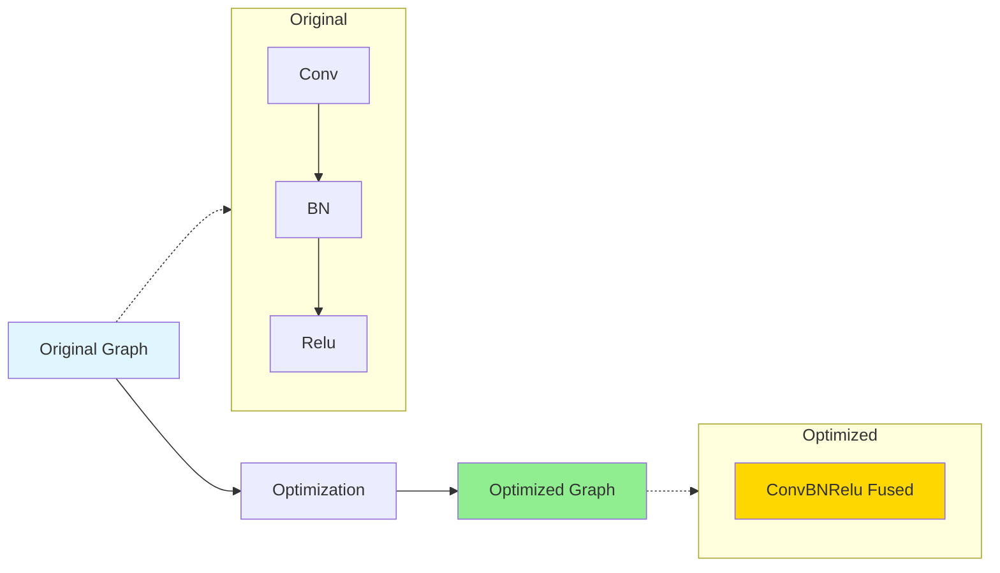
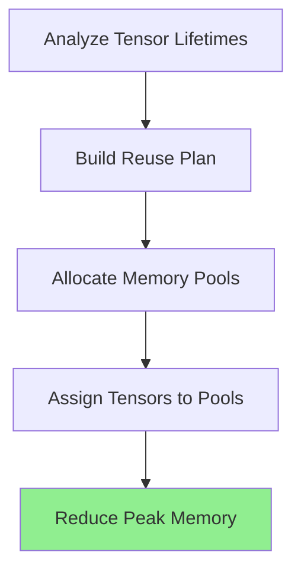

Graph optimization is a key feature of ONNX Runtime that improves inference performance by transforming the computational graph without changing its semantics. These optimizations reduce computation, memory usage, and improve hardware utilization.

## What are Graph Optimizations?

Graph optimizations are transformations applied to the ONNX computational graph:

- **Constant folding**: Pre-compute constant expressions
- **Operator fusion**: Combine multiple operators into a single kernel
- **Redundancy elimination**: Remove unnecessary computations
- **Layout transformations**: Optimize data layouts for hardware



<Info>
  Optimizations are semantics-preserving - they produce the same results while improving performance.
</Info>

## Optimization Levels

ONNX Runtime organizes optimizations into hierarchical levels:

<Tabs>
  <Tab title="Level 0: Disabled">
    ```python
    import onnxruntime as ort
    
    sess_options = ort.SessionOptions()
    sess_options.graph_optimization_level = ort.GraphOptimizationLevel.ORT_DISABLE_ALL
    
    session = ort.InferenceSession("model.onnx", sess_options)
    ```
    
    No optimizations applied. Useful for:
    - Debugging
    - Validating optimization correctness
    - Ensuring bit-exact reproducibility
  </Tab>
  
  <Tab title="Level 1: Basic">
    ```python
    import onnxruntime as ort
    
    sess_options = ort.SessionOptions()
    sess_options.graph_optimization_level = ort.GraphOptimizationLevel.ORT_ENABLE_BASIC
    
    session = ort.InferenceSession("model.onnx", sess_options)
    ```
    
    **Optimizations:**
    - Constant folding
    - Redundant node elimination
    - Simple semantics-preserving node fusions
    
    **Impact:** Low overhead, consistent improvements
  </Tab>
  
  <Tab title="Level 2: Extended">
    ```python
    import onnxruntime as ort
    
    sess_options = ort.SessionOptions()
    sess_options.graph_optimization_level = ort.GraphOptimizationLevel.ORT_ENABLE_EXTENDED
    
    session = ort.InferenceSession("model.onnx", sess_options)
    ```
    
    **Optimizations:**
    - All Level 1 optimizations
    - Complex node fusions
    - Advanced transformations
    - Execution provider-specific optimizations
    
    **Impact:** Significant performance gains
  </Tab>
  
  <Tab title="Level 3: All (Default)">
    ```python
    import onnxruntime as ort
    
    sess_options = ort.SessionOptions()
    sess_options.graph_optimization_level = ort.GraphOptimizationLevel.ORT_ENABLE_ALL
    
    session = ort.InferenceSession("model.onnx", sess_options)
    ```
    
    **Optimizations:**
    - All Level 2 optimizations
    - Layout optimizations (NCHW ↔ NHWC)
    - Hardware-specific transformations
    - Aggressive fusions
    
    **Impact:** Maximum performance, higher initialization time
  </Tab>
</Tabs>

<Warning>
  Higher optimization levels increase session creation time but improve inference performance. Use `ORT_ENABLE_ALL` for production.
</Warning>

## Graph Transformer Architecture

ONNX Runtime uses a transformer-based architecture for optimizations:

```cpp
// Simplified transformer interface
class GraphTransformer {
 public:
  // Apply transformation to graph
  Status Apply(Graph& graph, bool& modified) const;
  
  // Check if transformer should only run once
  virtual bool ShouldOnlyApplyOnce() const;
  
 protected:
  // Implementation-specific transformation logic
  virtual Status ApplyImpl(Graph& graph, bool& modified) const = 0;
};
```

### Transformer Categories

<CardGroup cols={2}>
  <Card title="Rule-Based" icon="book">
    Pattern matching and replacement
    - EliminateIdentity
    - ConstantFolding
    - CommonSubexpressionElimination
  </Card>
  
  <Card title="Fusion" icon="object-group">
    Combine multiple operators
    - ConvBatchNormFusion
    - MatMulAddFusion
    - GELUFusion
  </Card>
  
  <Card title="Layout" icon="table-cells">
    Data layout transformations
    - NCHWToNHWC
    - TransposeOptimizer
  </Card>
  
  <Card title="EP-Specific" icon="microchip">
    Hardware-specific optimizations
    - CUDA kernel fusions
    - TensorRT subgraph compilation
  </Card>
</CardGroup>

## Common Optimizations

### Constant Folding

Pre-compute operations with constant inputs:

<Tabs>
  <Tab title="Before">
    ```python
    # Graph structure
    input -> Shape -> Gather -> Unsqueeze -> Concat -> Reshape -> output
              ^        ^          ^
           constants  constants  constants
    ```
    
    Shape operations computed at runtime
  </Tab>
  
  <Tab title="After">
    ```python
    # Optimized graph
    input -> Reshape -> output
              ^
         pre-computed shape
    ```
    
    Shape computed once during optimization
  </Tab>
</Tabs>

<Tip>
  Constant folding is especially effective for models with dynamic shapes that use shape manipulation operations.
</Tip>

### Operator Fusion

Combine multiple operators into a single fused kernel:

<AccordionGroup>
  <Accordion title="Conv + BatchNorm Fusion">
    ```mermaid
    graph LR
        A[Input] --> B[Conv]
        B --> C[BatchNorm]
        C --> D[Output]
        
        E[Input] --> F[FusedConvBN]
        F --> G[Output]
        
        style F fill:#FFD700
    ```
    
    **Benefits:**
    - Reduces memory bandwidth
    - Fewer kernel launches
    - Can fold BN parameters into Conv weights
    
    **Implementation:**
    ```python
    # BatchNorm can be folded into Conv during inference
    # new_weight = weight * (gamma / sqrt(var + eps))
    # new_bias = beta + (bias - mean) * (gamma / sqrt(var + eps))
    ```
  </Accordion>
  
  <Accordion title="MatMul + Add Fusion">
    ```mermaid
    graph LR
        A[Input] --> B[MatMul]
        C[Bias] --> D[Add]
        B --> D
        D --> E[Output]
        
        F[Input] --> G[Gemm]
        H[Bias] --> G
        G --> I[Output]
        
        style G fill:#FFD700
    ```
    
    **Benefits:**
    - Single kernel call
    - Better cache utilization
    - BLAS optimization (GEMM)
  </Accordion>
  
  <Accordion title="Activation Fusions">
    Common patterns:
    - Conv + Relu → ConvRelu
    - MatMul + Relu → GemmRelu
    - Add + Relu → AddRelu
    - LayerNorm + GELU → LayerNormGELU
    
    **Example:**
    ```python
    # Before: Two separate kernels
    x = matmul(A, B)
    y = relu(x)
    
    # After: Single fused kernel
    y = matmul_relu(A, B)
    ```
  </Accordion>
  
  <Accordion title="Attention Fusion">
    Fuse multi-headed attention pattern:
    
    ```mermaid
    graph TB
        A[Input] --> B[Linear Q]
        A --> C[Linear K]
        A --> D[Linear V]
        B --> E[Reshape]
        C --> F[Reshape]
        D --> G[Reshape]
        E --> H[MatMul]
        F --> H
        H --> I[Scale]
        I --> J[Softmax]
        J --> K[MatMul]
        G --> K
        K --> L[Reshape]
        L --> M[Linear]
        M --> N[Output]
        
        O[Input] --> P[FusedAttention]
        P --> Q[Output]
        
        style P fill:#FFD700
    ```
    
    **Benefits:**
    - Massive reduction in memory transfers
    - Optimized attention kernels (FlashAttention)
    - Better GPU utilization
  </Accordion>
</AccordionGroup>

### Redundancy Elimination

Remove unnecessary operations:

<CodeGroup>
```python Identity Elimination
# Before
Input -> Identity -> Output

# After
Input -> Output
```

```python Dropout in Inference
# Before (training graph)
Input -> Dropout -> Output

# After (inference graph)
Input -> Output
# Dropout removed since not training
```

```python Transpose Cancellation
# Before
Input -> Transpose -> Transpose -> Output

# After
Input -> Output
# Adjacent transposes cancel out
```
</CodeGroup>

### Shape Inference

Propagate shape information through the graph:

```python
import onnx
from onnx import shape_inference

# Infer shapes
model = onnx.load("model.onnx")
inferred_model = shape_inference.infer_shapes(model)

# Now all intermediate tensors have known shapes
# Enables more optimizations
```

<Info>
  Shape inference is automatic in ONNX Runtime but can be pre-computed for faster session initialization.
</Info>

## Layout Optimizations

Transform data layouts for optimal hardware execution:

### NCHW vs NHWC

<Tabs>
  <Tab title="NCHW (Channels First)">
    ```
    [Batch, Channels, Height, Width]
    [1, 3, 224, 224]
    ```
    
    **Best for:**
    - CUDA GPU operations
    - Standard ONNX format
    - Most deep learning frameworks
  </Tab>
  
  <Tab title="NHWC (Channels Last)">
    ```
    [Batch, Height, Width, Channels]
    [1, 224, 224, 3]
    ```
    
    **Best for:**
    - CPU with SIMD (AVX, NEON)
    - TensorRT on certain GPUs
    - Memory-bound operations
  </Tab>
</Tabs>

### Automatic Layout Optimization

```python
import onnxruntime as ort

sess_options = ort.SessionOptions()

# Level 3 includes layout optimizations
sess_options.graph_optimization_level = ort.GraphOptimizationLevel.ORT_ENABLE_ALL

# ONNX Runtime automatically:
# 1. Analyzes the graph
# 2. Determines optimal layout per operator
# 3. Inserts Transpose operations where needed
# 4. Attempts to eliminate redundant Transposes

session = ort.InferenceSession("model.onnx", sess_options)
```

## Memory Optimizations

### Memory Reuse Planning

ONNX Runtime plans memory reuse to minimize peak memory:



<Accordion title="Memory Planning Example">
  ```python
  # Without memory reuse
  tensor1 = allocate(1MB)  # Peak: 1MB
  tensor2 = allocate(1MB)  # Peak: 2MB
  free(tensor1)
  tensor3 = allocate(1MB)  # Peak: 2MB
  
  # With memory reuse
  tensor1 = allocate(1MB)  # Peak: 1MB
  tensor2 = allocate(1MB)  # Peak: 2MB
  free(tensor1)
  tensor3 = reuse(tensor1) # Peak: 2MB (reuses tensor1's memory)
  ```
  
  Memory reuse reduces peak usage from 3MB to 2MB.
</Accordion>

### In-Place Operations

Some operations can modify tensors in-place:

```python
# Out-of-place: Requires new buffer
y = relu(x)  # x unchanged, y is new tensor

# In-place: Modifies x directly
relu_inplace(x)  # x modified, no new allocation
```

<Warning>
  In-place operations require careful analysis to ensure correctness. ONNX Runtime automatically detects safe in-place opportunities.
</Warning>

## Execution Provider Optimizations

EPs can provide hardware-specific optimizations:

### CUDA EP Optimizations

```python
import onnxruntime as ort

cuda_options = {
    'arena_extend_strategy': 'kSameAsRequested',
    'cudnn_conv_algo_search': 'EXHAUSTIVE',  # Best convolution algorithm
    'do_copy_in_default_stream': True,
}

session = ort.InferenceSession(
    "model.onnx",
    providers=[('CUDAExecutionProvider', cuda_options)]
)
```

**CUDA-specific optimizations:**
- Kernel fusion (multiple ops in one CUDA kernel)
- Memory coalescing
- Shared memory utilization
- cuDNN algorithm tuning

### TensorRT EP Optimizations

```python
import onnxruntime as ort

trt_options = {
    'trt_fp16_enable': True,
    'trt_int8_enable': False,
    'trt_max_workspace_size': 2 * 1024 * 1024 * 1024,
    'trt_engine_cache_enable': True,
}

session = ort.InferenceSession(
    "model.onnx",
    providers=[('TensorrtExecutionProvider', trt_options)]
)
```

**TensorRT optimizations:**
- Layer fusion (vertical and horizontal)
- Precision calibration (FP16, INT8)
- Kernel auto-tuning
- Dynamic tensor memory management

## Custom Graph Transformers

You can implement custom optimizations:

```python
import onnxruntime as ort
from onnxruntime import InferenceSession, SessionOptions

# Register custom transformer (C++ implementation required)
sess_options = ort.SessionOptions()

# Custom transformers run at specified optimization level
# Requires building ONNX Runtime from source
```

<Note>
  Custom transformers require C++ implementation and building ONNX Runtime from source. See the [Custom Operators](/advanced/custom-operators) guide for implementing custom functionality.
</Note>

## Inspecting Optimizations

### Save Optimized Model

```python
import onnxruntime as ort

sess_options = ort.SessionOptions()
sess_options.graph_optimization_level = ort.GraphOptimizationLevel.ORT_ENABLE_ALL
sess_options.optimized_model_filepath = "model_optimized.onnx"

# This saves the optimized graph
session = ort.InferenceSession("model.onnx", sess_options)

# Now inspect model_optimized.onnx to see applied optimizations
```

### Verbose Logging

```python
import onnxruntime as ort

sess_options = ort.SessionOptions()
sess_options.log_severity_level = 0  # Verbose

session = ort.InferenceSession("model.onnx", sess_options)

# Look for log messages like:
# "Applied GraphTransformer: ConstantFolding"
# "Applied GraphTransformer: CommonSubexpressionElimination"
# "Fused Conv+BatchNorm+Relu into ConvBatchNormRelu"
```

## Performance Impact

Typical performance improvements from optimizations:

<CardGroup cols={2}>
  <Card title="Computer Vision" icon="image">
    **ResNet-50:**
    - Basic: 5-10% faster
    - Extended: 20-40% faster
    - All: 30-50% faster
    
    **Key optimizations:**
    - Conv+BN fusion
    - Activation fusions
    - Layout optimization
  </Card>
  
  <Card title="NLP Models" icon="language">
    **BERT:**
    - Basic: 10-15% faster
    - Extended: 40-60% faster
    - All: 50-70% faster
    
    **Key optimizations:**
    - Attention fusion
    - LayerNorm fusion
    - Embedding optimization
  </Card>
</CardGroup>

<Info>
  Actual speedup depends on model architecture, hardware, and input shapes. Always benchmark your specific use case.
</Info>

## Best Practices

<AccordionGroup>
  <Accordion title="Use Maximum Optimization in Production">
    ```python
    # Production configuration
    sess_options = ort.SessionOptions()
    sess_options.graph_optimization_level = ort.GraphOptimizationLevel.ORT_ENABLE_ALL
    ```
    
    The initialization overhead is amortized over many inferences.
  </Accordion>
  
  <Accordion title="Save Optimized Models">
    ```python
    # Save optimized model for faster deployment
    sess_options.optimized_model_filepath = "model_opt.onnx"
    session = ort.InferenceSession("model.onnx", sess_options)
    
    # Deploy model_opt.onnx in production
    ```
    
    Pre-optimized models load faster.
  </Accordion>
  
  <Accordion title="Test Optimization Correctness">
    ```python
    import numpy as np
    
    # Run with and without optimizations
    def test_optimization():
        # Without optimization
        sess_opt_off = ort.InferenceSession(
            "model.onnx",
            sess_options_with_opt_disabled
        )
        out1 = sess_opt_off.run(None, inputs)
        
        # With optimization
        sess_opt_on = ort.InferenceSession(
            "model.onnx",
            sess_options_with_opt_enabled
        )
        out2 = sess_opt_on.run(None, inputs)
        
        # Compare outputs
        np.testing.assert_allclose(out1, out2, rtol=1e-5)
    ```
  </Accordion>
  
  <Accordion title="Profile Before and After">
    ```python
    sess_options = ort.SessionOptions()
    sess_options.enable_profiling = True
    sess_options.graph_optimization_level = ort.GraphOptimizationLevel.ORT_ENABLE_ALL
    
    session = ort.InferenceSession("model.onnx", sess_options)
    
    # Run benchmark
    for _ in range(100):
        session.run(None, inputs)
    
    prof_file = session.end_profiling()
    # Analyze profiling data
    ```
  </Accordion>
</AccordionGroup>

## Troubleshooting

### Optimization Increases Latency

```python
# Try disabling specific optimizations
sess_options = ort.SessionOptions()
sess_options.graph_optimization_level = ort.GraphOptimizationLevel.ORT_ENABLE_BASIC
# Or disable optimization entirely
sess_options.graph_optimization_level = ort.GraphOptimizationLevel.ORT_DISABLE_ALL
```

### Numerical Differences

Optimizations are semantics-preserving but may have small numerical differences:

```python
# If strict numerical reproducibility is required
sess_options.graph_optimization_level = ort.GraphOptimizationLevel.ORT_DISABLE_ALL
```

<Warning>
  Small numerical differences (1e-6) are normal due to different operation orders. Larger differences indicate a bug.
</Warning>

### Session Creation Too Slow

```python
# Pre-optimize and save model
sess_options = ort.SessionOptions()
sess_options.graph_optimization_level = ort.GraphOptimizationLevel.ORT_ENABLE_ALL
sess_options.optimized_model_filepath = "model_opt.onnx"
session = ort.InferenceSession("model.onnx", sess_options)

# In production, load pre-optimized model
session = ort.InferenceSession("model_opt.onnx")
```

## Next Steps

<CardGroup cols={2}>
  <Card title="Quantization" icon="compress" href="/model-conversion/quantization">
    Further optimize models with quantization
  </Card>
  <Card title="Model Optimization" icon="sliders" href="/inference/model-optimization">
    End-to-end model optimization workflow
  </Card>
  <Card title="Performance Tuning" icon="gauge-high" href="/performance/tuning">
    Complete performance tuning guide
  </Card>
  <Card title="Performance Tuning" icon="chart-line" href="/performance/tuning">
    Profile and analyze model performance
  </Card>
</CardGroup>

## Additional Resources

- [Graph Optimization Internals](https://github.com/microsoft/onnxruntime/blob/main/docs/Graph_Optimizations.md)
- [Transformer Implementation](https://github.com/microsoft/onnxruntime/tree/main/onnxruntime/core/optimizer)
- [Fusion Patterns](https://github.com/microsoft/onnxruntime/tree/main/onnxruntime/core/optimizer/fusion)
