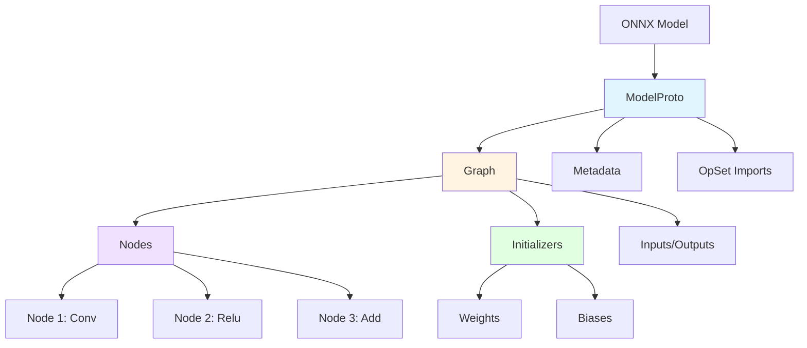
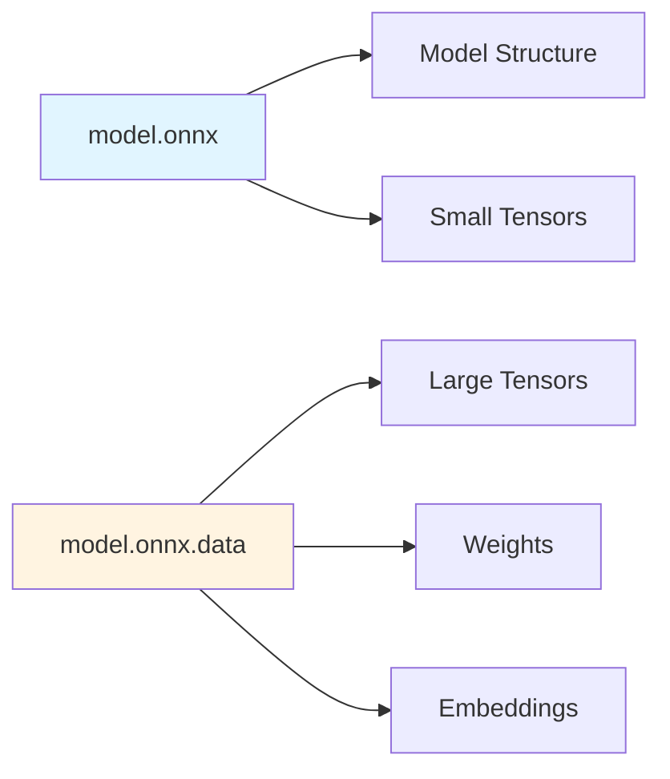

The Open Neural Network Exchange (ONNX) format is an open standard for representing machine learning models. ONNX Runtime uses this format as its primary input for inference and training.

## What is ONNX?

ONNX provides a common format for representing deep learning models, enabling interoperability between different frameworks:

- **Framework Agnostic**: Export from PyTorch, TensorFlow, scikit-learn, and more
- **Standardized Operators**: Well-defined operator specifications with versioning
- **Portable**: Run models across different hardware and platforms
- **Extensible**: Support for custom operators and domains

## ONNX Format Structure

An ONNX model consists of several key components:



### ModelProto

The top-level container for an ONNX model:

```protobuf
message ModelProto {
  int64 ir_version = 1;
  repeated OperatorSetIdProto opset_import = 8;
  string producer_name = 2;
  string producer_version = 3;
  string domain = 4;
  int64 model_version = 5;
  string doc_string = 6;
  GraphProto graph = 7;
  repeated StringStringEntryProto metadata_props = 14;
}
```

<Info>
  The `ir_version` field indicates the ONNX IR (Intermediate Representation) version, currently at version 9.
</Info>

### GraphProto

Represents the computational graph:

```protobuf
message GraphProto {
  repeated NodeProto node = 1;              // Computation nodes
  string name = 2;                          // Graph name
  repeated TensorProto initializer = 5;     // Constant tensors (weights)
  string doc_string = 10;                   // Documentation
  repeated ValueInfoProto input = 11;       // Graph inputs
  repeated ValueInfoProto output = 12;      // Graph outputs
  repeated ValueInfoProto value_info = 13;  // Intermediate values
}
```

### NodeProto

Defines individual operators in the graph:

```protobuf
message NodeProto {
  repeated string input = 1;        // Input tensor names
  repeated string output = 2;       // Output tensor names
  string name = 3;                  // Node name
  string op_type = 4;               // Operator type (e.g., "Conv", "Relu")
  string domain = 7;                // Operator domain
  repeated AttributeProto attribute = 5;  // Operator attributes
}
```

## Model Components

### Nodes (Operators)

Nodes represent operations in the computation graph:

<CodeGroup>
```python Example: Convolution Node
{
  "input": ["data", "conv_weight", "conv_bias"],
  "output": ["conv_output"],
  "name": "conv1",
  "op_type": "Conv",
  "domain": "",  # Empty string = ai.onnx domain
  "attribute": [
    {"name": "kernel_shape", "ints": [3, 3]},
    {"name": "strides", "ints": [1, 1]},
    {"name": "pads", "ints": [1, 1, 1, 1]}
  ]
}
```

```python Example: Relu Node
{
  "input": ["conv_output"],
  "output": ["relu_output"],
  "name": "relu1",
  "op_type": "Relu",
  "domain": ""
}
```
</CodeGroup>

### Initializers (Constants)

Initializers store constant tensors like model weights:

- Embedded directly in the model file
- Can be stored externally for large models
- Typically used for learned parameters

```python
# Accessing initializers in ONNX Runtime
import onnx

model = onnx.load("model.onnx")
for initializer in model.graph.initializer:
    print(f"Name: {initializer.name}, Shape: {initializer.dims}")
```

### Inputs and Outputs

Define the model's interface:

```python
# ValueInfoProto structure
{
  "name": "input_tensor",
  "type": {
    "tensor_type": {
      "elem_type": 1,  # FLOAT
      "shape": {
        "dim": [
          {"dim_param": "batch_size"},  # Dynamic dimension
          {"dim_value": 3},              # Static dimension
          {"dim_value": 224},
          {"dim_value": 224}
        ]
      }
    }
  }
}
```

<Accordion title="Supported Tensor Data Types">
  ONNX supports various tensor element types:
  
  | Type | Value | Description |
  |------|-------|-------------|
  | FLOAT | 1 | 32-bit floating point |
  | UINT8 | 2 | 8-bit unsigned integer |
  | INT8 | 3 | 8-bit signed integer |
  | UINT16 | 4 | 16-bit unsigned integer |
  | INT16 | 5 | 16-bit signed integer |
  | INT32 | 6 | 32-bit signed integer |
  | INT64 | 7 | 64-bit signed integer |
  | STRING | 8 | String type |
  | BOOL | 9 | Boolean type |
  | FLOAT16 | 10 | 16-bit floating point |
  | DOUBLE | 11 | 64-bit floating point |
  | UINT32 | 12 | 32-bit unsigned integer |
  | UINT64 | 13 | 64-bit unsigned integer |
  | BFLOAT16 | 16 | Brain floating point |
  | FLOAT8E4M3FN | 17 | 8-bit floating point (E4M3) |
  | INT4 | 21 | 4-bit signed integer (packed) |
  | UINT4 | 22 | 4-bit unsigned integer (packed) |
</Accordion>

## Operator Sets (OpSets)

ONNX uses versioned operator sets to ensure compatibility:

```python
# OpSet import in model
opset_import {
  domain: ""           # ai.onnx domain
  version: 18         # OpSet version 18
}
opset_import {
  domain: "com.microsoft"  # Custom domain
  version: 1
}
```

<Info>
  ONNX Runtime supports multiple OpSet versions simultaneously. Models are compatible as long as the runtime supports the required OpSet version.
</Info>

### OpSet Evolution

Operator definitions evolve across versions:

- **New operators**: Added in newer OpSets
- **Updated semantics**: Changes to existing operators
- **Deprecated operators**: Old operators may be removed
- **Attribute changes**: New or modified operator attributes

## ORT Format

ONNX Runtime also supports its own optimized format (ORT format):

<CardGroup cols={2}>
  <Card title="ONNX Format" icon="file-code">
    - Standard ONNX protobuf format
    - Portable across runtimes
    - Human-readable (with tools)
    - Larger file size
  </Card>
  <Card title="ORT Format" icon="bolt">
    - Optimized for ONNX Runtime
    - Faster loading time
    - Smaller file size
    - Pre-applied optimizations
  </Card>
</CardGroup>

### Converting to ORT Format

<CodeGroup>
```python Python
import onnxruntime as ort

# Create session with optimization
sess_options = ort.SessionOptions()
sess_options.graph_optimization_level = ort.GraphOptimizationLevel.ORT_ENABLE_ALL
sess_options.optimized_model_filepath = "model.ort"

# This creates the .ort file
session = ort.InferenceSession("model.onnx", sess_options)
```

```bash CLI
python -m onnxruntime.tools.convert_onnx_models_to_ort \
  --optimization_level all \
  model.onnx
```
</CodeGroup>

<Warning>
  ORT format models are version-specific. Models saved in one ONNX Runtime version may not load in different versions.
</Warning>

## External Data

Large models can store tensors externally:



### External Data Configuration

```python
import onnx

# Save with external data
onnx.save_model(
    model,
    "model.onnx",
    save_as_external_data=True,
    all_tensors_to_one_file=True,
    location="weights.bin",
    size_threshold=1024,  # Tensors > 1KB stored externally
    convert_attribute=False
)
```

<Tip>
  External data is useful for:
  - Models larger than 2GB (protobuf limit)
  - Faster git operations (diff, clone)
  - Separate weight management
</Tip>

## Subgraphs and Control Flow

ONNX supports control flow operators with subgraphs:

### If Operator

```python
# If node with two subgraphs
{
  "op_type": "If",
  "input": ["condition"],
  "output": ["result"],
  "attribute": [
    {
      "name": "then_branch",
      "type": "GRAPH",
      "g": <GraphProto>  # Then branch subgraph
    },
    {
      "name": "else_branch",
      "type": "GRAPH",
      "g": <GraphProto>  # Else branch subgraph
    }
  ]
}
```

### Loop Operator

Implements iterative computation:

```python
{
  "op_type": "Loop",
  "input": ["max_trip_count", "condition", "loop_state"],
  "output": ["final_state", "scan_outputs"],
  "attribute": [
    {
      "name": "body",
      "type": "GRAPH",
      "g": <GraphProto>  # Loop body subgraph
    }
  ]
}
```

## Model Metadata

Models can include custom metadata:

```python
import onnx
from onnx import helper

model = onnx.load("model.onnx")

# Add metadata
model.metadata_props.append(
    helper.make_metadata_prop("author", "Your Name")
)
model.metadata_props.append(
    helper.make_metadata_prop("license", "MIT")
)
model.metadata_props.append(
    helper.make_metadata_prop("description", "Image classifier")
)

onnx.save(model, "model_with_metadata.onnx")
```

## Inspecting ONNX Models

<Tabs>
  <Tab title="Python">
    ```python
    import onnx
    
    model = onnx.load("model.onnx")
    
    # Print model structure
    print(f"Producer: {model.producer_name} {model.producer_version}")
    print(f"IR version: {model.ir_version}")
    print(f"OpSet version: {model.opset_import[0].version}")
    
    # Print graph info
    graph = model.graph
    print(f"\nGraph: {graph.name}")
    print(f"Inputs: {len(graph.input)}")
    print(f"Outputs: {len(graph.output)}")
    print(f"Nodes: {len(graph.node)}")
    print(f"Initializers: {len(graph.initializer)}")
    
    # Print input/output details
    for inp in graph.input:
        print(f"\nInput: {inp.name}")
        print(f"  Type: {inp.type.tensor_type.elem_type}")
        print(f"  Shape: {[d.dim_value or d.dim_param for d in inp.type.tensor_type.shape.dim]}")
    ```
  </Tab>
  
  <Tab title="CLI (Netron)">
    ```bash
    # Install Netron for visual inspection
    pip install netron
    
    # View model in browser
    netron model.onnx
    ```
  </Tab>
  
  <Tab title="ONNX Runtime">
    ```python
    import onnxruntime as ort
    
    session = ort.InferenceSession("model.onnx")
    
    # Get model metadata
    meta = session.get_modelmeta()
    print(f"Producer: {meta.producer_name}")
    print(f"Graph name: {meta.graph_name}")
    print(f"Version: {meta.version}")
    
    # Get input/output info
    for inp in session.get_inputs():
        print(f"\nInput: {inp.name}")
        print(f"  Shape: {inp.shape}")
        print(f"  Type: {inp.type}")
    
    for out in session.get_outputs():
        print(f"\nOutput: {out.name}")
        print(f"  Shape: {out.shape}")
        print(f"  Type: {out.type}")
    ```
  </Tab>
</Tabs>

## Best Practices

<AccordionGroup>
  <Accordion title="Use Symbolic Dimensions">
    Define dynamic dimensions with names instead of -1:
    ```python
    # Good
    input_tensor.type.tensor_type.shape.dim[0].dim_param = "batch_size"
    
    # Avoid
    input_tensor.type.tensor_type.shape.dim[0].dim_value = -1
    ```
  </Accordion>
  
  <Accordion title="Optimize Before Deployment">
    Always optimize models before deployment:
    - Use graph optimizations
    - Consider quantization
    - Convert to ORT format for production
  </Accordion>
  
  <Accordion title="Version Your Models">
    Use the `model_version` field to track model versions:
    ```python
    model.model_version = 2
    ```
  </Accordion>
  
  <Accordion title="Document Your Model">
    Add documentation strings and metadata:
    ```python
    model.doc_string = "ResNet-50 image classifier trained on ImageNet"
    model.graph.doc_string = "Main inference graph"
    ```
  </Accordion>
</AccordionGroup>

## Next Steps

<CardGroup cols={2}>
  <Card title="Execution Providers" icon="server" href="/concepts/execution-providers">
    Learn how execution providers accelerate model inference
  </Card>
  <Card title="Graph Optimizations" icon="wand-magic-sparkles" href="/concepts/graph-optimizations">
    Understand optimization techniques for better performance
  </Card>
  <Card title="Sessions" icon="circle-play" href="/concepts/sessions">
    Deep dive into InferenceSession configuration
  </Card>
  <Card title="Custom Operators" icon="code" href="/advanced/custom-operators">
    Learn how to add custom operators
  </Card>
</CardGroup>
