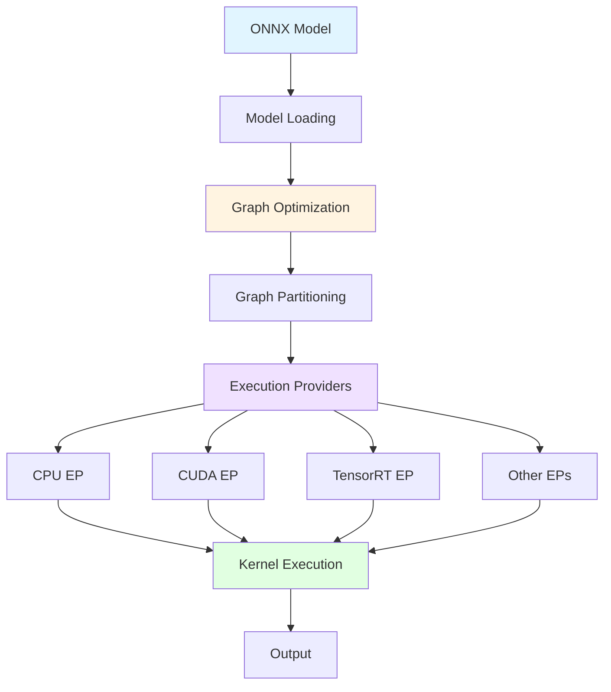

ONNX Runtime is a high-performance inference and training engine for machine learning models. Understanding its core concepts is essential for effectively deploying and optimizing your models.

## What is ONNX Runtime?

ONNX Runtime is a cross-platform, high-performance scoring engine for Open Neural Network Exchange (ONNX) models. It enables:

- **Fast inference** across different hardware platforms
- **Flexible deployment** from cloud to edge devices
- **Hardware acceleration** through execution providers
- **Model optimization** via graph transformations

## Core Architecture

ONNX Runtime's architecture consists of several key components working together:

<Accordion title="Architecture Diagram">

</Accordion>

## Key Components

### 1. InferenceSession

The `InferenceSession` is the main entry point for running models. It:

- Loads and parses ONNX models
- Manages execution providers
- Handles model initialization and optimization
- Executes inference requests

<CodeGroup>
```python Python
import onnxruntime as ort

# Create inference session
session = ort.InferenceSession("model.onnx")

# Run inference
outputs = session.run(["output"], {"input": input_data})
```

```cpp C++
// Create session
Ort::Env env(ORT_LOGGING_LEVEL_WARNING, "test");
Ort::SessionOptions session_options;
Ort::Session session(env, "model.onnx", session_options);

// Run inference
auto output_tensors = session.Run(Ort::RunOptions{nullptr}, 
                                   input_names, input_tensors,
                                   output_names);
```
</CodeGroup>

### 2. Execution Providers

Execution Providers (EPs) are the hardware acceleration interfaces that enable ONNX Runtime to run on different hardware platforms:

<CardGroup cols={2}>
  <Card title="CPU" icon="microchip">
    Default provider for general-purpose execution
  </Card>
  <Card title="CUDA" icon="bolt">
    NVIDIA GPU acceleration
  </Card>
  <Card title="TensorRT" icon="rocket">
    Optimized inference on NVIDIA GPUs
  </Card>
  <Card title="DirectML" icon="windows">
    Hardware acceleration on Windows
  </Card>
</CardGroup>

### 3. Graph Optimizations

ONNX Runtime applies multiple levels of graph optimizations:

- **Level 1 (Basic)**: Constant folding, redundant node elimination
- **Level 2 (Extended)**: Node fusions, operator transformations
- **Level 3 (Layout)**: Data layout optimizations for specific hardware

### 4. ONNX Format

The ONNX format is an open standard for representing machine learning models:

- **Protobuf-based**: Efficient serialization format
- **Framework-agnostic**: Works with PyTorch, TensorFlow, etc.
- **Operator standard**: Well-defined operator specifications
- **Extensible**: Support for custom operators

## Execution Flow

Here's how ONNX Runtime processes an inference request:

<Steps>
  <Step title="Model Loading">
    The ONNX model is loaded and parsed into an internal graph representation
  </Step>
  
  <Step title="Graph Optimization">
    Multiple optimization passes transform the graph for better performance
  </Step>
  
  <Step title="Graph Partitioning">
    The graph is partitioned across available execution providers based on their capabilities
  </Step>
  
  <Step title="Session Initialization">
    Kernels are instantiated and memory is allocated
  </Step>
  
  <Step title="Inference Execution">
    Input data flows through the graph, with each node executed by its assigned execution provider
  </Step>
</Steps>

## Performance Considerations

<AccordionGroup>
  <Accordion title="Threading Model">
    ONNX Runtime uses two types of thread pools:
    
    - **Intra-op threads**: Parallelize computation within a single operator
    - **Inter-op threads**: Execute independent operators in parallel
    
    Configure via `SessionOptions`:
    ```python
    sess_options = ort.SessionOptions()
    sess_options.intra_op_num_threads = 4
    sess_options.inter_op_num_threads = 2
    ```
  </Accordion>
  
  <Accordion title="Memory Management">
    - Automatic memory planning and reuse
    - Arena-based allocators for efficient allocation
    - Support for pre-allocated memory binding
  </Accordion>
  
  <Accordion title="Data Types">
    Supported tensor data types include:
    - Floating point: float32, float16, bfloat16
    - Integer: int8, int16, int32, int64
    - Quantized: uint8, int8 for quantization
    - Special: float8 variants for modern hardware
  </Accordion>
</AccordionGroup>

## Runtime Configuration

### Session Options

The `SessionOptions` class provides extensive configuration:

```python
sess_options = ort.SessionOptions()

# Optimization level
sess_options.graph_optimization_level = ort.GraphOptimizationLevel.ORT_ENABLE_ALL

# Execution mode
sess_options.execution_mode = ort.ExecutionMode.ORT_SEQUENTIAL

# Enable profiling
sess_options.enable_profiling = True
```

<Note>
  The default optimization level `ORT_ENABLE_ALL` enables all graph optimizations. For debugging, use `ORT_DISABLE_ALL`.
</Note>

### Run Options

Control individual inference runs:

```python
run_options = ort.RunOptions()
run_options.log_severity_level = 0  # Verbose logging
run_options.terminate = False  # Don't terminate on timeout
```

## Model Validation

ONNX Runtime validates models during loading:

- **Graph structure**: Ensures valid connections between nodes
- **Type checking**: Verifies operator input/output types
- **Shape inference**: Propagates tensor shapes through the graph
- **Operator availability**: Checks that required operators are supported

<Warning>
  If your model uses custom operators, you must register them before creating the session.
</Warning>

## Next Steps

<CardGroup cols={2}>
  <Card title="ONNX Format" icon="file-code" href="/concepts/onnx-format">
    Learn about the ONNX model format specification
  </Card>
  <Card title="Execution Providers" icon="server" href="/concepts/execution-providers">
    Explore available execution providers and their capabilities
  </Card>
  <Card title="Sessions" icon="circle-play" href="/concepts/sessions">
    Deep dive into InferenceSession and session management
  </Card>
  <Card title="Graph Optimizations" icon="wand-magic-sparkles" href="/concepts/graph-optimizations">
    Understand optimization techniques and transformations
  </Card>
</CardGroup>

## Additional Resources

- [ONNX Specification](https://github.com/onnx/onnx/blob/main/docs/IR.md)
- [Operator Schemas](https://github.com/onnx/onnx/blob/main/docs/Operators.md)
- [Performance Tuning Guide](/performance/tune-performance)
