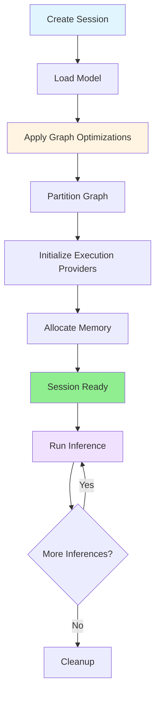

The `InferenceSession` is the primary interface for running ONNX models in ONNX Runtime. It manages model loading, optimization, initialization, and execution.

## Session Lifecycle

Understanding the session lifecycle is crucial for optimal performance:



<Steps>
  <Step title="Creation">
    Session object is instantiated with options
  </Step>
  
  <Step title="Model Loading">
    ONNX model is parsed and internal graph is built
  </Step>
  
  <Step title="Optimization">
    Graph transformations are applied based on optimization level
  </Step>
  
  <Step title="Partitioning">
    Graph is partitioned across execution providers
  </Step>
  
  <Step title="Initialization">
    Kernels are instantiated and memory is pre-allocated
  </Step>
  
  <Step title="Execution">
    Multiple inferences can be run efficiently
  </Step>
</Steps>

## Creating Sessions

### Basic Session Creation

<CodeGroup>
```python Python
import onnxruntime as ort

# Simple session creation
session = ort.InferenceSession("model.onnx")

# Run inference
outputs = session.run(
    ["output"],  # Output names
    {"input": input_data}  # Input dict
)
```

```cpp C++
#include <onnxruntime_cxx_api.h>

// Create environment
Ort::Env env(ORT_LOGGING_LEVEL_WARNING, "test");

// Create session
Ort::SessionOptions session_options;
Ort::Session session(env, L"model.onnx", session_options);

// Run inference
auto output_tensors = session.Run(
    Ort::RunOptions{nullptr},
    input_names.data(),
    input_tensors.data(),
    input_names.size(),
    output_names.data(),
    output_names.size()
);
```

```csharp C#
using Microsoft.ML.OnnxRuntime;

// Create session
var session = new InferenceSession("model.onnx");

// Prepare inputs
var inputs = new List<NamedOnnxValue>
{
    NamedOnnxValue.CreateFromTensor("input", inputTensor)
};

// Run inference
var outputs = session.Run(inputs);
```
</CodeGroup>

### Advanced Session Configuration

<Tabs>
  <Tab title="SessionOptions">
    ```python
    import onnxruntime as ort
    
    sess_options = ort.SessionOptions()
    
    # Graph optimization level
    sess_options.graph_optimization_level = ort.GraphOptimizationLevel.ORT_ENABLE_ALL
    
    # Execution mode
    sess_options.execution_mode = ort.ExecutionMode.ORT_PARALLEL
    
    # Threading configuration
    sess_options.intra_op_num_threads = 4
    sess_options.inter_op_num_threads = 2
    
    # Enable profiling
    sess_options.enable_profiling = True
    
    # Save optimized model
    sess_options.optimized_model_filepath = "model_optimized.onnx"
    
    # Create session with options
    session = ort.InferenceSession(
        "model.onnx",
        sess_options,
        providers=['CUDAExecutionProvider', 'CPUExecutionProvider']
    )
    ```
  </Tab>
  
  <Tab title="Environment">
    ```python
    import onnxruntime as ort
    
    # Create custom environment
    env = ort.Env(
        log_severity_level=ort.OrtLoggingLevel.ORT_LOGGING_LEVEL_WARNING,
        log_id="MyApp"
    )
    
    # Use environment with session
    session = ort.InferenceSession(
        "model.onnx",
        sess_options,
        env=env
    )
    ```
  </Tab>
  
  <Tab title="Provider Options">
    ```python
    import onnxruntime as ort
    
    # Configure execution providers
    cuda_options = {
        'device_id': 0,
        'arena_extend_strategy': 'kNextPowerOfTwo',
        'gpu_mem_limit': 2 * 1024 * 1024 * 1024,
        'cudnn_conv_algo_search': 'EXHAUSTIVE',
    }
    
    session = ort.InferenceSession(
        "model.onnx",
        providers=[
            ('CUDAExecutionProvider', cuda_options),
            'CPUExecutionProvider'
        ]
    )
    ```
  </Tab>
</Tabs>

## SessionOptions Configuration

### Graph Optimization Levels

<Accordion title="Optimization Level Details">
  ```python
  import onnxruntime as ort
  
  # Level 0: Disable all optimizations
  sess_options.graph_optimization_level = ort.GraphOptimizationLevel.ORT_DISABLE_ALL
  
  # Level 1: Basic optimizations (default)
  # - Constant folding
  # - Redundant node elimination
  # - Semantics-preserving node fusions
  sess_options.graph_optimization_level = ort.GraphOptimizationLevel.ORT_ENABLE_BASIC
  
  # Level 2: Extended optimizations
  # - All Level 1 optimizations
  # - Complex node fusions
  # - More aggressive transformations
  sess_options.graph_optimization_level = ort.GraphOptimizationLevel.ORT_ENABLE_EXTENDED
  
  # Level 3: All optimizations
  # - All Level 2 optimizations
  # - Layout optimizations
  # - Hardware-specific transformations
  sess_options.graph_optimization_level = ort.GraphOptimizationLevel.ORT_ENABLE_ALL
  ```
</Accordion>

<Info>
  Higher optimization levels may increase session creation time but improve inference speed. Use `ORT_ENABLE_ALL` for production.
</Info>

### Execution Modes

<CardGroup cols={2}>
  <Card title="Sequential Mode" icon="list">
    ```python
    sess_options.execution_mode = ort.ExecutionMode.ORT_SEQUENTIAL
    ```
    
    Operators execute one after another. Lower memory usage, simpler debugging.
  </Card>
  
  <Card title="Parallel Mode" icon="network-wired">
    ```python
    sess_options.execution_mode = ort.ExecutionMode.ORT_PARALLEL
    ```
    
    Independent operators execute in parallel. Better throughput, higher memory usage.
  </Card>
</CardGroup>

### Threading Configuration

ONNX Runtime uses two types of thread pools:

```python
import onnxruntime as ort

sess_options = ort.SessionOptions()

# Intra-op threads: Parallelize within operators
# Good for: Matrix multiplication, convolutions
sess_options.intra_op_num_threads = 4

# Inter-op threads: Execute independent operators in parallel
# Good for: Models with many parallel branches
sess_options.inter_op_num_threads = 2
```

<Tabs>
  <Tab title="CPU-bound Models">
    ```python
    # Use more intra-op threads
    sess_options.intra_op_num_threads = 8
    sess_options.inter_op_num_threads = 1
    ```
  </Tab>
  
  <Tab title="Complex Graphs">
    ```python
    # Balance both thread pools
    sess_options.intra_op_num_threads = 4
    sess_options.inter_op_num_threads = 4
    ```
  </Tab>
  
  <Tab title="Single-threaded">
    ```python
    # Force single-threaded execution
    sess_options.intra_op_num_threads = 1
    sess_options.inter_op_num_threads = 1
    sess_options.execution_mode = ort.ExecutionMode.ORT_SEQUENTIAL
    ```
  </Tab>
</Tabs>

<Warning>
  Setting too many threads can hurt performance due to context switching and cache contention. Start with the number of physical cores.
</Warning>

## Running Inference

### Basic Inference

```python
import onnxruntime as ort
import numpy as np

session = ort.InferenceSession("model.onnx")

# Prepare input
input_data = np.random.randn(1, 3, 224, 224).astype(np.float32)

# Run inference
outputs = session.run(
    ["output"],  # Output names (None for all outputs)
    {"input": input_data}  # Input dict: {name: numpy_array}
)

print(outputs[0].shape)
```

### Multiple Inputs and Outputs

```python
import onnxruntime as ort
import numpy as np

session = ort.InferenceSession("multi_io_model.onnx")

# Prepare multiple inputs
inputs = {
    "image": np.random.randn(1, 3, 224, 224).astype(np.float32),
    "metadata": np.array([[1, 2, 3, 4]], dtype=np.float32)
}

# Request multiple outputs
output_names = ["class_probs", "bounding_boxes", "confidence"]
outputs = session.run(output_names, inputs)

class_probs, boxes, confidence = outputs
```

### Using RunOptions

```python
import onnxruntime as ort

session = ort.InferenceSession("model.onnx")

# Create run options
run_options = ort.RunOptions()
run_options.log_severity_level = 0  # Verbose logging
run_options.log_verbosity_level = 1
run_options.terminate = False  # Don't terminate on timeout

# Run with options
outputs = session.run(
    ["output"],
    {"input": input_data},
    run_options
)
```

## Model Metadata

### Inspecting Session Information

```python
import onnxruntime as ort

session = ort.InferenceSession("model.onnx")

# Get model metadata
meta = session.get_modelmeta()
print(f"Producer: {meta.producer_name}")
print(f"Graph name: {meta.graph_name}")
print(f"Description: {meta.description}")
print(f"Version: {meta.version}")
print(f"Custom metadata: {meta.custom_metadata_map}")

# Get input information
for inp in session.get_inputs():
    print(f"\nInput: {inp.name}")
    print(f"  Shape: {inp.shape}")
    print(f"  Type: {inp.type}")

# Get output information
for out in session.get_outputs():
    print(f"\nOutput: {out.name}")
    print(f"  Shape: {out.shape}")
    print(f"  Type: {out.type}")

# Get providers
print(f"\nProviders: {session.get_providers()}")
```

### Dynamic Input Shapes

Handle models with dynamic dimensions:

```python
import onnxruntime as ort

session = ort.InferenceSession("dynamic_model.onnx")

# Check input shape
inp = session.get_inputs()[0]
print(f"Input shape: {inp.shape}")  # e.g., ['batch_size', 3, 'height', 'width']

# Dynamic dimensions are strings, fixed dimensions are integers
for i, dim in enumerate(inp.shape):
    if isinstance(dim, str):
        print(f"Dimension {i} is dynamic: {dim}")
    else:
        print(f"Dimension {i} is fixed: {dim}")

# Run with different batch sizes
for batch_size in [1, 4, 8]:
    input_data = np.random.randn(batch_size, 3, 224, 224).astype(np.float32)
    outputs = session.run(["output"], {"input": input_data})
    print(f"Batch {batch_size}: output shape {outputs[0].shape}")
```

## IOBinding for Advanced Usage

IOBinding provides fine-grained control over memory and device placement:

### Basic IOBinding

```python
import onnxruntime as ort
import numpy as np

session = ort.InferenceSession("model.onnx")

# Create IO binding
io_binding = session.io_binding()

# Bind input
input_data = np.random.randn(1, 3, 224, 224).astype(np.float32)
io_binding.bind_cpu_input('input', input_data)

# Bind output
io_binding.bind_output('output')

# Run inference
session.run_with_iobinding(io_binding)

# Get output
output = io_binding.copy_outputs_to_cpu()[0]
```

### GPU Memory Binding

```python
import onnxruntime as ort
import numpy as np

session = ort.InferenceSession(
    "model.onnx",
    providers=['CUDAExecutionProvider']
)

io_binding = session.io_binding()

# Keep input on GPU
input_data = np.random.randn(1, 3, 224, 224).astype(np.float32)
io_binding.bind_cpu_input('input', input_data)

# Keep output on GPU
io_binding.bind_output('output', 'cuda')

# Run on GPU
session.run_with_iobinding(io_binding)

# Output stays on GPU - efficient for multiple operations
ort_value = io_binding.get_outputs()[0]

# Copy to CPU only when needed
output = ort_value.numpy()
```

### Pre-allocated Output

```python
import onnxruntime as ort
import numpy as np

session = ort.InferenceSession("model.onnx")
io_binding = session.io_binding()

# Pre-allocate output buffer
output_shape = (1, 1000)  # Known output shape
output_buffer = np.empty(output_shape, dtype=np.float32)

# Bind to pre-allocated buffer
io_binding.bind_cpu_input('input', input_data)
io_binding.bind_output(
    'output',
    'cpu',
    output_buffer
)

session.run_with_iobinding(io_binding)
# Result is now in output_buffer, no copy needed
```

## Profiling and Debugging

### Enable Profiling

```python
import onnxruntime as ort

sess_options = ort.SessionOptions()
sess_options.enable_profiling = True

session = ort.InferenceSession("model.onnx", sess_options)

# Run inference
for _ in range(100):
    outputs = session.run(["output"], {"input": input_data})

# Get profiling results
prof_file = session.end_profiling()
print(f"Profiling data saved to: {prof_file}")
```

<Tip>
  View the profiling JSON file in Chrome's tracing viewer (chrome://tracing) for detailed performance analysis.
</Tip>

### Verbose Logging

```python
import onnxruntime as ort

sess_options = ort.SessionOptions()
sess_options.log_severity_level = 0  # 0=Verbose, 1=Info, 2=Warning, 3=Error, 4=Fatal

session = ort.InferenceSession("model.onnx", sess_options)
```

### Session Configuration String

Use configuration strings for advanced settings:

```python
import onnxruntime as ort

sess_options = ort.SessionOptions()

# Add session configuration
sess_options.add_session_config_entry(
    'session.intra_op.allow_spinning', '1'
)
sess_options.add_session_config_entry(
    'session.inter_op.allow_spinning', '1'
)

session = ort.InferenceSession("model.onnx", sess_options)
```

## Memory Management

### Memory Arenas

ONNX Runtime uses arena-based memory allocation:

```python
import onnxruntime as ort

sess_options = ort.SessionOptions()

# Disable memory arena for deterministic memory usage
sess_options.enable_cpu_mem_arena = False
sess_options.enable_mem_pattern = False

session = ort.InferenceSession("model.onnx", sess_options)
```

<Warning>
  Disabling memory arenas may increase memory allocation overhead. Only disable for debugging or when you need deterministic memory usage.
</Warning>

### Memory Pattern Optimization

```python
import onnxruntime as ort

sess_options = ort.SessionOptions()

# Enable memory pattern optimization (default: True)
sess_options.enable_mem_pattern = True

# Pre-allocate based on pattern
sess_options.enable_mem_reuse = True

session = ort.InferenceSession("model.onnx", sess_options)
```

## Best Practices

<AccordionGroup>
  <Accordion title="Reuse Sessions">
    Creating a session is expensive. Reuse the same session for multiple inferences:
    
    ```python
    # Good: Reuse session
    session = ort.InferenceSession("model.onnx")
    for data in dataset:
        outputs = session.run(["output"], {"input": data})
    
    # Bad: Create session in loop
    for data in dataset:
        session = ort.InferenceSession("model.onnx")  # DON'T DO THIS
        outputs = session.run(["output"], {"input": data})
    ```
  </Accordion>
  
  <Accordion title="Thread Safety">
    Sessions are thread-safe for inference:
    
    ```python
    import concurrent.futures
    
    session = ort.InferenceSession("model.onnx")
    
    def run_inference(data):
        return session.run(["output"], {"input": data})
    
    # Safe to use from multiple threads
    with concurrent.futures.ThreadPoolExecutor(max_workers=4) as executor:
        results = list(executor.map(run_inference, dataset))
    ```
  </Accordion>
  
  <Accordion title="Use IOBinding for Performance">
    Use IOBinding when running multiple inferences:
    
    ```python
    session = ort.InferenceSession("model.onnx")
    io_binding = session.io_binding()
    
    for data in dataset:
        io_binding.bind_cpu_input('input', data)
        io_binding.bind_output('output')
        session.run_with_iobinding(io_binding)
        output = io_binding.copy_outputs_to_cpu()[0]
        # Process output
        io_binding.clear_binding_inputs()
        io_binding.clear_binding_outputs()
    ```
  </Accordion>
  
  <Accordion title="Optimize Session Options">
    Tune session options for your use case:
    
    ```python
    sess_options = ort.SessionOptions()
    
    # Production: Maximum performance
    sess_options.graph_optimization_level = ort.GraphOptimizationLevel.ORT_ENABLE_ALL
    sess_options.execution_mode = ort.ExecutionMode.ORT_PARALLEL
    
    # Development: Easier debugging
    sess_options.graph_optimization_level = ort.GraphOptimizationLevel.ORT_DISABLE_ALL
    sess_options.execution_mode = ort.ExecutionMode.ORT_SEQUENTIAL
    sess_options.log_severity_level = 0
    ```
  </Accordion>
</AccordionGroup>

## Next Steps

<CardGroup cols={2}>
  <Card title="Graph Optimizations" icon="wand-magic-sparkles" href="/concepts/graph-optimizations">
    Learn about optimization techniques that improve performance
  </Card>
  <Card title="Execution Providers" icon="server" href="/concepts/execution-providers">
    Understand hardware acceleration options
  </Card>
  <Card title="Performance Tuning" icon="gauge-high" href="/performance/tuning">
    Optimize inference performance for production
  </Card>
  <Card title="Performance Tuning" icon="layer-group" href="/performance/tuning">
    Improve throughput with performance tuning
  </Card>
</CardGroup>
